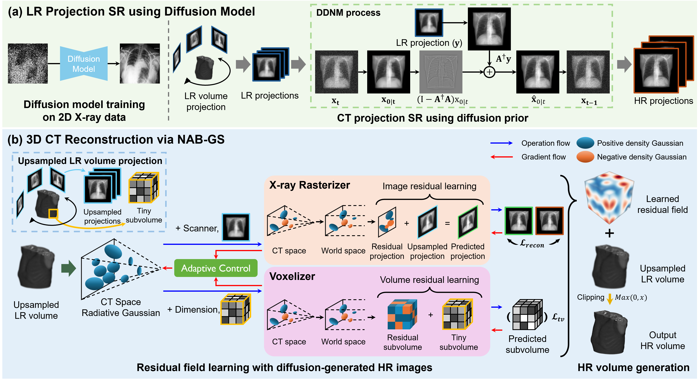

# Zero-shot CT Super-Resolution using Diffusion-based 2D Projection Priors and Signed 3D Gaussians

<div>
MICCAI 2026 Early Accept (Top 9%) ·
Paper link (https://arxiv.org/abs/2508.15151)
</div>

## Overview

<div>
  
  <br>
  <em><b>Figure 1.</b> Overview of our framework. (a) LR projection SR using diffusion model: A pre-trained diffusion model with 2D X-ray data is employed within the DDNM to
generate HR 2D CT projection images from LR counterparts. (b) 3D CT reconstruction via NAB-GS: Using both positive and negative density Gaussians, we model a signed residual field between diffusion-generated HR projections and LR counterparts. For HR volume generation, the learned residual field is added onto the upsampled LR volume.
</em>
</div>

---

## Abstract

Computed tomography (CT) is important in clinical diagnosis, but acquiring high-resolution (HR) CT is constrained by radiation exposure risks. While deep learning-based super-resolution (SR) methods have shown promise for reconstructing HR CT from low-resolution (LR) inputs, **supervised approaches require paired datasets that are often unavailable**. Zero-shot methods address this limitation by operating on single LR inputs; however, they frequently fail to recover fine structural details due to limited LR information within individual volumes.

To overcome these limitations, we propose a novel **zero-shot 3D CT SR framework** that integrates diffusion-based upsampled 2D projection priors into the 3D reconstruction process. Our framework consists of two stages:

1. **LR CT Projection SR**: A diffusion model trained on abundant 2D X-ray data upsamples LR CT projections via DDNM, enriching the scarce high-frequency information in LR inputs.
2. **3D CT Reconstruction via NAB-GS**: Our novel Negative Alpha Blending 3D Gaussian Splatting reconstructs the HR volume by modeling both positive and negative Gaussian densities to learn the signed residual field between diffusion-generated HR projections and upsampled LR projections.

---


## Results

### Quantitative Comparison

| Method | UHRCT 4× PSNR↑ | UHRCT 4× SSIM↑ | UHRCT 8× PSNR↑ | UHRCT 8× SSIM↑ | MELA 4× PSNR↑ | MELA 4× SSIM↑ | MELA 8× PSNR↑ | MELA 8× SSIM↑ |
|---|:---:|:---:|:---:|:---:|:---:|:---:|:---:|:---:|
| Trilinear | 24.56 | <u>0.8877</u> | 21.14 | <u>0.8125</u> | 33.64 | <u>0.9472</u> | 30.27 | <u>0.9063</u> |
| Cubic | 24.61 | 0.8783 | <u>21.46</u> | 0.8013 | 33.55 | 0.9431 | <u>30.49</u> | 0.9005 |
| NeRF | 20.86 | 0.6745 | 18.92 | 0.5797 | 29.76 | 0.8088 | 28.73 | 0.7873 |
| CuNeRF | <u>25.25</u> | 0.8459 | 21.04 | 0.7572 | <u>33.76</u> | 0.9096 | 30.11 | 0.8535 |
| **Ours** | **25.42** | **0.8957** | **21.96** | **0.8172** | **34.17** | **0.9525** | **30.81** | **0.9115** |
| Supervised (ArSSR) | 22.78 | 0.8936 | 21.10 | 0.8336 | 33.00 | 0.9658 | 30.70 | 0.9343 |


### Clinical Expert Evaluation

Expert radiologist evaluations confirm the clinical potential of our framework at **4× upscaling**, demonstrating:
- Improved delineation of fine anatomical structures
- Reduction of aliasing artifacts common in LR reconstructions
- Diagnostic-quality outputs without paired training data

---

## Getting Started

This repository contains the release-facing entry points for our zero-shot CT SR pipeline. The DDNM projection-prior stage is prepared as a thin wrapper around the development DDNM repository, so the heavy diffusion model checkpoint can live on Hugging Face instead of GitHub.

### Repository Layout

```text
ddnm_inference/
  run_ddnm_projection_sr.py          # .npy projection stack -> DDNM-compatible run
  requirements-ddnm-wrapper.txt
scripts/
  run_ddnm_mela_4x_example.sh        # example MELA 0050 4x command
  run_ddnm_mela_8x_example.sh        # example MELA 0050 8x command
examples/mela_0050/
  mela_0050_projection_4x_128x128.npy
  mela_0050_projection_8x_64x64.npy
hf_model_card/
  README.md                          # suggested Hugging Face model card
references/
  REFERENCES.md
```

### DDNM Model Checkpoint

The diffusion checkpoint is too large for GitHub. We recommend creating this Hugging Face model repository:

```text
<hf-username-or-org>/ddnm-xray512-ct-projection-prior
```

Use `apache-2.0` as the Hugging Face model license to match this repository's Apache-2.0 release license.

Upload the checkpoint as:

```text
ema_0.9999_620000.pt
```

The model-card draft is available at `hf_model_card/README.md`.

### Inputs

The DDNM wrapper accepts one projection stack as `.npy`:

```text
[N, H, W] float32
```

For the provided MELA example:

```text
examples/mela_0050/mela_0050_projection_4x_128x128.npy  # [100, 128, 128]
examples/mela_0050/mela_0050_projection_8x_64x64.npy    # [100, 64, 64]
```

The wrapper converts the `.npy` stack into the pickle structure expected by the DDNM code and passes it through `--degraded_path`. The high-resolution GT pickle is still required by the original DDNM dataset loader for projection count, normalization, and optional evaluation.

### Run MELA 4x DDNM

```bash
pip install -r ddnm_inference/requirements-ddnm-wrapper.txt

DDNM_ROOT=/path/to/DDNM \
GT_PICKLE=/path/to/MELA_GT_512_rmbed/mela_0050_rmbed.pickle \
GPU=0 \
bash scripts/run_ddnm_mela_4x_example.sh
```

To check paths and the resolved command without running:

```bash
DDNM_ROOT=/path/to/DDNM \
GT_PICKLE=/path/to/MELA_GT_512_rmbed/mela_0050_rmbed.pickle \
bash scripts/run_ddnm_mela_4x_example.sh --dry-run
```

Expected output:

```text
<DDNM_ROOT>/exp/image_samples/mela_0050_ddnm_x4_ddnm_orig/
  pred_png/
  pred_npy/
  whole.npy
  configs.yml
  run.log
```

### Run MELA 8x DDNM

```bash
DDNM_ROOT=/path/to/DDNM \
GT_PICKLE=/path/to/MELA_GT_512_rmbed/mela_0050_rmbed.pickle \
GPU=0 \
bash scripts/run_ddnm_mela_8x_example.sh
```

### Use a Local Checkpoint Instead of Hugging Face

```bash
MODEL_CHECKPOINT=/path/to/ema_0.9999_620000.pt \
DDNM_ROOT=/path/to/DDNM \
GT_PICKLE=/path/to/MELA_GT_512_rmbed/mela_0050_rmbed.pickle \
GPU=0 \
bash scripts/run_ddnm_mela_4x_example.sh
```

### DDNM Parameters Used in the Paper Experiments

| Scale | `deg_scale` | `eta` | `sigma_y` | `clip_max` | default setup |
|---|---:|---:|---:|---:|---|
| 4x | 4.0 | 0.990 | 0.0010 | 1.05 | `ddnm_orig` |
| 8x | 8.0 | 0.990 | 0.0025 | 1.05 | `ddnm_orig` |

### Notes for GitHub Release

- Do not commit diffusion checkpoints or generated DDNM outputs.
- Keep example `.npy` files small enough for GitHub. The included MELA 0050 projection examples are intended as smoke-test inputs.
- The wrapper assumes the existing DDNM codebase is available separately through `DDNM_ROOT`.
- The wrapper creates a DDNM-compatible degraded pickle under `ddnm_work/inputs/`.

## Citation

If you find this work useful, please cite our paper:

```bibtex
@article{noh2025zero,
  title={Zero-shot CT Super-Resolution using Diffusion-based 2D Projection Priors and Signed 3D Gaussians},
  author={Noh, Jeonghyun and Oh, Hyun-Jic and Jeong, Won-Ki},
  journal={arXiv preprint arXiv:2508.15151},
  year={2025}
}
```

---

## Acknowledgements

This work was conducted at the **High-performance Visual Computing Lab (HVCL), Korea University**.

We gratefully acknowledge the public CT datasets used for evaluation, and the authors of DDNM, Improved Diffusion / Guided Diffusion, TIGRE, and 3D Gaussian Splatting for their foundational contributions. See `references/REFERENCES.md` for code references and citation notes.

---

<div align="center">
  <sub>© 2026 Jeonghyun Noh, Hyun-Jic Oh, Won-Ki Jeong | Korea University</sub>
  <br>
  <sub>⭐ Star this repo to stay updated on the code release!</sub>
</div>
